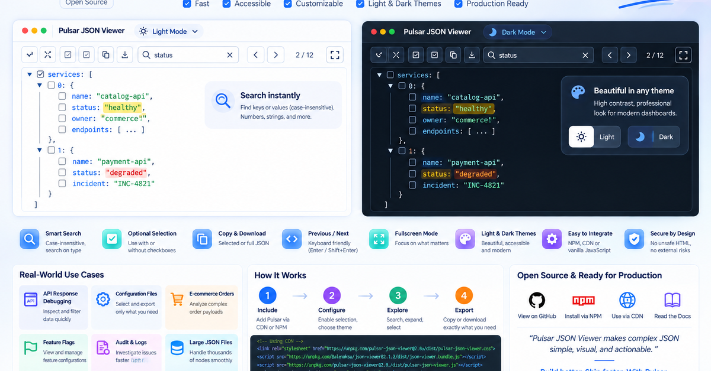
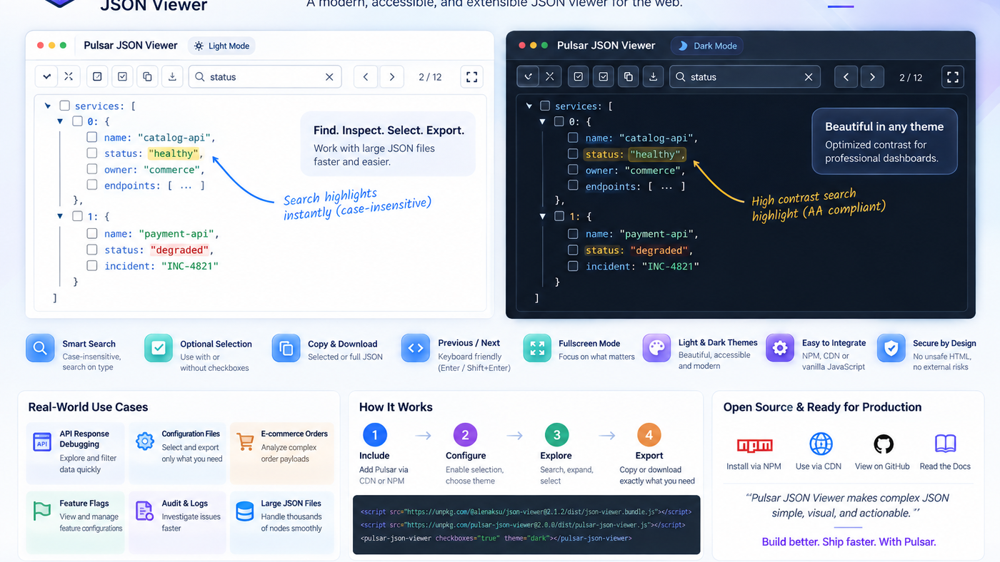
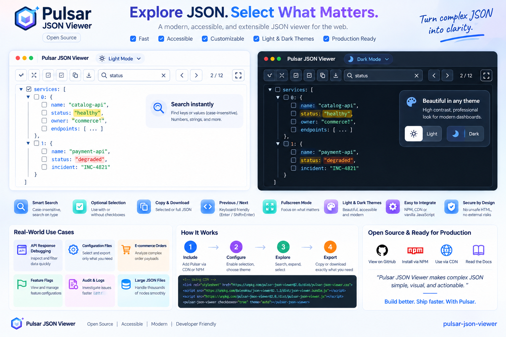

# Pulsar JSON Viewer social media kit

This folder contains ready-to-use visual assets and post structures for sharing Pulsar JSON Viewer on Medium, LinkedIn, release notes, and project pages.

## Recommended images

### LinkedIn launch image

Use `social/pulsar-linkedin-1200x628.png` for LinkedIn feed posts and link previews. The composition is cropped to a social-friendly wide ratio and emphasizes the light and dark themes, search, optional selection, and production integration story.

### Medium hero image

Use `social/pulsar-medium-1400x788.png` as a Medium article hero. Keep it near the opening so readers understand the product before reaching implementation details.

### Mechanism overview

Use `social/pulsar-mechanism-overview.png` when explaining the product mechanism: include the component, configure selection and theme, explore JSON, then copy or download the result.

Full-resolution artwork is preserved in this folder for custom crops and release pages.

## Suggested Medium story

### Title ideas

- We Extended a Proven JSON Viewer Instead of Rebuilding One
- Making Large JSON Easier to Search, Select, and Share
- Building an Accessible JSON Viewer for Real Dashboard Workflows

### Storyline

1. **The problem**: large JSON becomes difficult to inspect in debugging tools and internal dashboards.
2. **The decision**: keep `@alenaksu/json-viewer` responsible for rendering and tree interaction instead of replacing a mature open-source core.
3. **The extension**: Pulsar adds optional checkbox selection, selected-only copy and download, search navigation, themes, a sticky toolbar, and fullscreen workflows.
4. **Accessibility**: explain keyboard behavior, visible focus, native checkbox semantics, mixed state, and high-contrast light and dark palettes.
5. **Embedding**: show CDN and npm integration with explicit version pinning.
6. **Production use cases**: API debugging, configuration inspection, observability data, feature flags, ecommerce orders, audit logs, and large JSON files.
7. **Open-source responsibility**: clearly credit the upstream project and explain the extension boundary.
8. **Call to action**: link to examples, documentation, and source.

### Opening paragraph sample

> Debugging a large JSON payload is rarely difficult because JSON itself is complicated. It is difficult because the useful five fields are buried inside hundreds of values. Pulsar JSON Viewer keeps the mature tree experience of `@alenaksu/json-viewer` and adds a focused workflow for searching, selecting, copying, and downloading exactly what matters.

## Suggested LinkedIn launch post

**Pulsar JSON Viewer is ready for real dashboard workflows.**

We built it on top of `@alenaksu/json-viewer` rather than replacing a solid open-source tree component. Pulsar adds the workflow features we repeatedly needed in application tooling:

- optional checkbox selection
- selected-only copy and download
- copy-all mode when selection is disabled
- case-insensitive search with Previous, Next, Enter, and Shift+Enter navigation
- sticky controls and fullscreen mode for large payloads
- accessible light and dark themes
- CDN and npm friendly distribution

The most important design decision was keeping the extension boundary small. Rendering, expand and collapse, tree focus, and core navigation remain upstream. Pulsar concentrates on selection and productivity.

If you work with API payloads, configuration, observability data, audit logs, or large nested JSON, the examples are designed to show those workflows directly.

Suggested tags: `#opensource` `#javascript` `#webcomponents` `#accessibility` `#frontend` `#developerexperience`

## Mechanism caption

**Include → Configure → Explore → Extract**

Load the upstream viewer and Pulsar, choose checkbox and theme configuration, search or expand the JSON, then copy or download either the selected structure or the complete payload.

## Posting guidance

Use screenshots or generated visuals that reflect features that actually exist in the release. Avoid invented adoption numbers, star counts, download counts, customer logos, testimonials, or benchmark claims. For accessibility claims, describe the implemented semantics and verified contrast rather than making a broad certification claim.

When publishing CDN instructions, pin exact package versions in article code samples so old posts do not silently change behavior after a future release.
